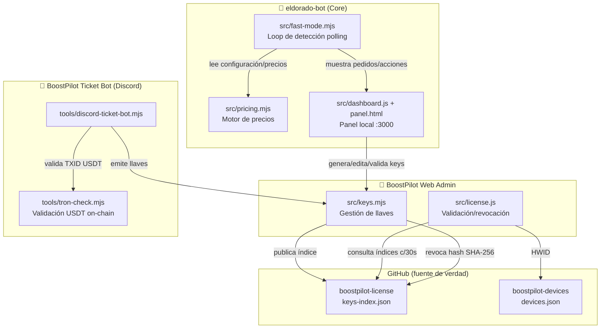

# AGENTS.md — BoostPilot / Eldorado-Bot

Bot semi-automático para boosters de Eldorado.gg + cliente Electron (BoostPilot) + negocio de keys USDT. Responder siempre en **español**.

## 🏗️ ARQUITECTURA GENERAL (3 PILARES)

El ecosistema completo está dividido en 3 componentes que se comunican entre sí:

### 🤖 1) eldorado-bot (Core)
- **Función:** Detecta solicitudes de boosting en tiempo real en Eldorado.gg mediante polling continuo (loop infinito en `fast-mode.mjs`), sin depender de un navegador abierto todo el tiempo. Solo usa Chrome DevTools CDP en el login inicial para capturar cookies/tokens.
- **Motor de precios** (`src/pricing.mjs`): algoritmos por segmentos, tiers, unidades, multiplicadores de rango, multiplicadores de RR (Valorant), multi-brawler (Brawl Stars), trofeos/hora (Clash Royale), filtros anti-failsafe (minPrice/maxPrice).
- **Panel local** (`src/dashboard.js` + `src/panel.html`): corre en `http://localhost:3000`. Permite al booster ver pedidos en cola con urgencia/ETA, confirmar/descartar ofertas, filtrar por región (Valorant, LoL) y editar mensajes automáticos (bienvenida, seguimiento, entrega, confirmación).

### 🔑 2) BoostPilot Web Admin (Servidor de Licencias)
- **Función:** Administrar llaves y ventas sin ejecutar el bot de Eldorado (`tools/remote-admin.mjs` o `npm run admin`).
- **Seguridad:** protegido por la variable de entorno `ELBOT_MASTER_KEY`.
- **Gestión de llaves** (`src/keys.mjs` & `src/license.js`):
  - 1 dispositivo por llave (vía HWID)
  - Llaves trial (por horas) y suscripciones periódicas (por días)
  - Revocación a distancia vía repos GitHub públicos (`boostpilot-license` / `boostpilot-devices`) publicando solo hashes SHA-256
  - **Fail-open** si GitHub no responde (para no perjudicar usuarios activos)

### 🎫 3) BoostPilot Ticket Bot (Discord)
- **Función:** Bot de Discord nativo (`tools/discord-ticket-bot.mjs`) usando WebSocket nativo de Node 22 sin dependencias externas pesadas.
- **Flujo de tickets de compra:**
  1. El cliente abre ticket y selecciona su plan
  2. El bot genera la dirección de pago USDT TRC20
  3. El cliente ingresa su TXID y el bot lo valida on-chain en la red Tron vía API TronGrid (`tools/tron-check.mjs`)
  4. El staff confirma con 1 clic → el bot genera la llave en `keys.mjs` y se la entrega al cliente en el canal privado
- **Extras:** contadores en tiempo real de miembros/clientes y auto-asignación del rol Member

### 🔗 Comunicación entre componentes
- El **Web Admin** y el **Core** comparten `src/keys.mjs` para generar/validar llaves.
- El **Ticket Bot** usa `keys.mjs` para emitir llaves y `license.js` para revocar/validar.
- Todos dependen de los repos GitHub `boostpilot-license` (índice de keys) y `boostpilot-devices` (HWID) como fuente de verdad para validación/revocación.
- El bot valida la llave contra GitHub cada 30 segundos.



## Raíz

`C:\Users\cenn\Documents\Default Project\eldorado-bot`

## 📂 Mapas de módulos (arquitectura estricta)

### [ENTRYPOINT] Cliente de Escritorio
- `launcher/main.js`: Electron Launcher, punto de entrada del usuario.
  - Inicia el flujo hacia `login.js`.
  - Realiza verificación HWID/Hash llamando a `license.js`.

### [MÓDULO 1] Eldorado Bot (BoostPilot Core) — Motor de Automatización
- `login.js`: login CDP y tokens. Llama a la API.
- `eldorado-api.mjs`: API REST central del bot.
- `fast-mode.mjs`: Fast Mode Polling. Alimentado por la API.
- `pricing.mjs`: motor de precios. Invocado por `fast-mode.mjs`.
- `dashboard.js` & `panel.html`: dashboard local de usuario.
  - **PUERTO fijo: 3000.**

### [MÓDULO 2] BoostPilot Web Admin & Licencias — Seguridad y Gestión
- `license.js`: sincronización con GitHub y sistema de revocación.
- `keys.mjs`: gestor de llaves. Invocado por `license.js` y por el Ticket Bot.
- `remote-admin.mjs` & `store.js`: servidor Web Admin.
  - Integra: `ELBOT_MASTER_KEY`, `admin.html` (panel) y `landing.html` (tienda).
  - **PUERTO fijo: 8080.**

### [MÓDULO 3] BoostPilot Ticket Bot — Ventas y Soporte Automático
- `tron-check.mjs`: verificador on-chain de pagos USDT vía TronGrid.
- `discord-ticket-bot.mjs`: bot de Discord. Escucha la verificación on-chain.
  - Administra contadores y roles en el servidor de Discord.
  - **Dependencia clave:** al verificar el pago, llama a `keys.mjs` (Módulo 2) para generar y entregar la llave al cliente.

## 🚫 REGLAS ESTRICTAS DE FLUJO DE DATOS (obligatorias)
1. **Generación de llaves:** el Módulo 3 (Discord) NUNCA genera llaves por sí mismo. SIEMPRE solicita la generación a `keys.mjs` del Módulo 2.
2. **Puertos fijos:** nunca superponer el puerto 3000 (Dashboard Local) con el 8080 (Administración global).
3. **Validación:** el Launcher DEBE pasar por la verificación de HWID en `license.js` antes de permitir la ejecución completa del Core.

| Carpeta | Qué |
|---|---|
| `src/` | Bot + panel HTML/JS |
| `launcher/` | App Electron (build NSIS) |
| `config/rules.json` | Precios, tiers, regiones, planes, webhook |
| `state/` | Secretos (NO viaja en el instalador) |
| `tools/` | Discord, publish, tests. One-offs en `tools/archive/` |
| `release/` | Instaladores `.exe` |

## Comandos críticos

```
node --check <archivo>          # validar sintaxis ANTES de tocar código
node tools/run-tests.mjs        # 82 tests (sintaxis + pricing + keys + anti-failsafe)
npm.cmd run dist                # build NSIS (workdir: launcher/)
Start-Process '...Setup.exe' -ArgumentList '/S','/currentuser' -PassThru -Wait  # instalar
```

**NUNCA** usar `npm run dist` sin workdir `launcher/`. PowerShell: usar parámetro `workdir`, no `cd`.

## Build → Release (flujo completo)

1. Editar versión en **3 archivos**: `package.json` (raíz), `launcher/package.json`, `launcher/main.js` (`const VERSION`)
2. `node --check src/<archivo.mjs>` en cada archivo modificado
3. `node tools/run-tests.mjs` → 0 fallos
4. `npm.cmd run dist` (workdir `launcher/`) → genera exe en `release/`
5. `Start-Process ...` instalar silencioso
6. Verificar: `%LocalAppData%\Programs\BoostPilot\resources\bot\src\<archivo>` con `Select-String`
7. Subir exe: borrar asset viejo del release GitHub → subir nuevo (`tools/reupload-exe.mjs` o curl manual)
8. Actualizar hash: `node tools/installer-hash.mjs`
9. Publicar en Discord: `node tools/discord-publish.mjs` (+ `node tools/discord-faq.mjs`)

El build **vacia el webhook** de rules.json (`tools/sanitize-config.mjs`). El `devicesToken` SÍ viaja.

## Perfiles per-key (CRÍTICO)

El bot carga perfiles desde `%APPDATA%\eldorado-bot-launcher\bot-state\clientcfg\<keyId>.json` que **sobreescriben** `config/rules.json`. Si el pricing no cambia en el panel, **parchear también el perfil activo**.

⚠️ **La reinstalación del exe puede pisar el perfil activo** (observado en v1.7.20: el perfil perdió `pricePerUnit` de Rocket "Wins Boost", reaparecieron `minPrice`/`minHours` en Brawl y la categoría "Custom Request" en Fortnite). Tras cada instalación/update silencioso, **verificar y restaurar** el perfil activo desde `config/rules.json` si hace falta:

## `src/` — mapas rápidos

- **`pricing.mjs`** — motor de precios: `computePrice()` → `computeTiers()` / `computeUnits()` / `computeSegments()`. `DEFAULTS` — precios por defecto para segments ($5/1000), tiers ($3/div, 2h, 3 divs), units ($2/unit, 1h). Se usa como fallback cuando config está vacía. `parseRR()` (current RR), `parseDesiredRR()` (over 50rr, 50+ rr, desired rr N), `parseRankRange()` (current/desired/Game Level), `unitsCount()` (Number of games/wins, soporta hasta 9999). `regionFromText()` exportada (no duplicada en fast-mode). `multipliersFromText()` ordena keys por longitud (más largas primero) + word boundaries (`\b`) para evitar collisions (ej: "Solo" vs "Solo queue"). `budgetFromText()` parsea el presupuesto del cliente pero **no bloquea** por él: se eliminaron los 3 bloques `out-of-budget` (que devolvían `{ok:false, reason:'fuera de presupuesto'}` cuando el presupuesto era menor al precio). El bot siempre ofrece el precio real. Anti-failsafe: `minPrice`/`maxPrice` por categoría en tiers, `minPricePerOffer`/`maxPricePerOffer` globales en fastMode. Regiones a nivel juego: `gameCfg.regionLocked` + `gameCfg.regions`. `fmtEta(hours, { hoursOnly })` — cuando `hoursOnly: true`, muestra siempre horas (nunca convierte a días). Clash Royale usa `hoursOnly: true` (ritmo por hora). `rankIndex()` busca coincidencia exacta y normalizada primero (soporta rangos numéricos como FC26 "Rank 15", "Division 10", "Rank 5") y como fallback convierte dígitos a romanos (1→I, 2→II, etc.) para soportar "Master 1" = "Master I". `parseMultiBrawlerDescriptions()` soporta "brawler from X to Y" y "brawler X to Y" (regex flexible con `(?:from\s+)?(?:\d{3,4}\s+)?`). `stripBom()`/`readJsonSync()` — protección contra BOM en todos los archivos JSON leídos.
- **`fast-mode.mjs`** — loop infinito, **nunca** `await` dentro de handlers. `_chatPlan(p, noPrice)` — cuando `noPrice=true`, usa `customRequestMessage` ("dame más detalles") en vez de `welcomeMessage`. `_categoryShouldSkip()` / `_pricingSkipReason()`. `CATEGORY_TOGGLE_KEYS` incluye: `trophy boost`, `brawlers rank`, `prestige icon`, `rank boost`, `net wins`, `placement matches`, `wins boost`, `custom request`. `_cleanOldOrders()` elimina órdenes >24h cada `saveOrders()`. `_cleanupTracked()` limpia entries >1h del Map cuando supera 500 entradas. `markSeen()` se ejecuta **después** de `processRequest()` exitoso (no antes). `_sendDeliveredMessage(o)` y `_sendOrderReceivedMessage(o)` — auto-chat messages para pedidos entregados/confirmados. `sendDeliveredById(id)` y `sendOrderReceivedById(id)` — métodos públicos para envío manual. Detección de entrega en `checkOrders()` — verifica `sellerState === 'Delivered'`, `deliveryStatus`, `buyerConfirmed`. `_startRefreshLoop()` — refresca token cada 10 min para evitar expiración.
- **`rules.js`** — `applyFilters()` soporta `skipDuo`, `skipSquad`, `skipConsole` por juego (`gameCfg.skipDuo`). Valores default: `true` (skip si falta el campo). `categoryToggleKey()` mapea texto del request a keys: `net wins`, `placement matches`, `wins boost`. `humanSummary()` normaliza espacios y trunca a 2000 chars (antes 220) para que las descripciones de órdenes se muestren completas en el panel.
- **`dashboard.js`** — panel localhost:3000, rutas `/api/*`, kick cada 30s por HWID/índice. `readBody()` limitado a 1MB (`req.destroy()` en overflow). Session GC cada 5min (idle >1h sin device). Trials sin restricción de juego (`!out.subscription.trial`). Endpoints: `POST /api/orders/delivered` y `POST /api/orders/received`.
- **`bot.js`** — `stripBom()` + `readJsonSync()` para BOM. `persistConfig()` usa atomic writes (`.tmp` + `rename`). `upsertRecord()` cap a 500 entradas. `writeAuthOwner()` con `.catch()`. `CHAT_MSG_KEYS` incluye: `welcomeMessage`, `followUpMessage`, `deliveredMessage`, `orderReceivedMessage`.
- **`keys.mjs`** — `save()` con write lock serializado (`enqueueWrite`) + atomic writes. `logKeyEvent()` atomic + cap 300. `keyEvents()` BOM-protected. `vip: !!rec.vip`, `maxDevices: Math.max(1, parseInt(rec.maxDevices, 10) || 1)` — lee del registro real.
- **`license.js`** — `readJson()` BOM-protected. `fetchDevices()` usa `Authorization: token` para evitar rate limits de GitHub.
- **`eldorado-api.mjs`** — API pura (cookies, sin navegador). Captura `retry-after` header → `err.retryAfter`. Keep-alive HTTP via undici Agent (`setGlobalDispatcher`). Si undici no está disponible, usa el dispatcher por defecto de Node. `persistCookies()` y `_applySetCookie()` usan `indexOf('=')` en vez de `split('=')` para no truncar tokens. `refresh()` llama `authentication/refreshTokens` para mantener viva la sesión.
- **`store.js`** — `readBody()` limitado a 1MB. Store deshabilitado por defecto (`store.enabled: false`).
 - **`panel.html`** — editor de precios (segments/tiers/units). Regiones en header del juego (`.pr-game-regions`). Save per-categoría. Rendimiento optimizado: eliminado `content-visibility: auto` en `.tab`, renderizado perezoso con caché `PR_INITIALIZED` para cambio de pestaña instantáneo. Clash Royale muestra `Trofeos por hora (ritmo)`. **Historial**: `HIST_STATUSES = ['placed','pending','opened','messaged','skipped','rejected','unresolved','ready','failed','canceled','seen']`; input `#histSearch` + contador `#histCount` que filtran en vivo por texto sobre `description`/`buyer`/`category`. **Idiomas de categorías**: `var CAT_I18N` (es/en/fr/pt/de/it) + `catLabel(cat)` (fallback español → original) aplicado en pills, header de card y tag "Categoría" del feed; los `data-cat` conservan la clave original.
 - **`admin.html`** — panel de administración para generar keys. Campos: plan, días, horas, cliente, vendedor, cantidad, precio, pagada, nota. El selector `#plan` incluye opción `Personalizado` (primera); al elegir un plan real autocompleta `#price`/`#days`/`#hours`, y `custom` deja los campos editables (placeholder 30). **No hay selector de juego** — las keys se crean sin `game` (acceso completo a todos). Sin restricción de trial — se pueden crear keys de cualquier duración.

## Regiones Eldorado

`REGION_CANON` en pricing.mjs: **EU, NA, AP, LATAM, BRASIL, KR**. "Oceania" → AP. Regiones ahora a nivel juego (`gameCfg.regionLocked` + `gameCfg.regions`). Solo se verifican regiones para juegos con `regionLocked: true` (Valorant, LoL). Juegos globales (Brawl Stars, Fortnite) ignoran regiones. Desactivar una región = el bot saltea requests de esa región vía `computePrice()` → `_pricingSkipReason('se salta')`.

## Campos Eldorado en el bot

El bot parsea campos del request de Eldorado vía `buildText()`:
- "Current Rank Diamond III" / "Desired Rank Ascendant II" / "Game Level Ascendant II"
- "Current RR 57" / "over 50rr" / "50+ rr" / "desired rr 20"
- "Number of games 1" / "Number of wins 2"
- "Previous season rank Ascendant I"
- "Server NA" / "Region EU"

## Negocio (resumen)

- 1 key = 1 dispositivo. Keys en GitHub (`cennnnnn1/boostpilot-license`), nunca en el instalador.
- Validación remota: índice `keys-index.json` en GitHub, check cada 30s.
- Dispositivos en `cennnnnn1/boostpilot-devices`. Reset HWID = kick (no bloqueo). Revoke = pausa. Delete = total.
- Trials: acceso a todos los juegos (sin restricción por juego). Duration configurable via `hours`.
- Pago USDT TRC20, verificación on-chain TronGrid (`tools/tron-check.mjs`).
- Discord: guild `1536591772807860314`, ticket bot, `#downloads`, `#faq`. Tokens en `state/discord.auth.json`.

## Seguridad

- **Viaja en el exe**: `src/`, `rules.json` (sin webhook), seed-state (sin keys), Node, `devicesToken`.
- **NO viaja**: `state/` completo (`github.json`, `auth.*`, `keys.json` con keys vivas, webhook).
- **Nunca** imprimir tokens, master key, webhook, auth.
- Exe sin firmar → SmartScreen en clientes, se maneja con `#faq`.
- `ELBOT_MASTER_KEY` en env var — nunca imprimirla.

## Notas de implementación

- `fast-mode.mjs`: los handlers corren en un loop infinito. Un `await` dentro de un handler bloquea todo el loop.
- `fast-mode.mjs`: cuando no hay precio automático, `_chatPlan(p, true)` usa `customRequestMessage` ("dame más detalles") en vez de `welcomeMessage`. Solo el handler auto (línea 372) pasa `noPrice=true`.
- `pricing.mjs`: `roundPrice()` — <5 → ×0.5, <50 → int, <200 → ×5, ≥200 → ×10.
- `pricing.mjs`: tiers mode — precios son **suma** de entries en el rango, no pasos × precio fijo.
- `pricing.mjs`: `parseRR()` ignora números que siguen a "over/above/desired" para no confundir current con desired RR. `rankIndex()` busca coincidencia exacta y stripped primero antes de normalizar números romanos; así "Rank 15" y "Rank 5" (FC26) o "Division 10" matchean directamente sin romperse por conversión a "Rank V". `parseMultiBrawlerDescriptions()` regex flexible: `targetRe` acepta `(?:from\s+)?(?:\d{3,4}\s+)?` entre brawler name y "to", `currentRe` acepta `(?:from\s+)?` entre brawler name y número. `computeSegments()` usa `cfg.per` como fallback cuando `s.per` no está en el segmento (antes defaultaba a 1). Cuando `cfg.pacePerDay > 0`, horas se calcula como `trofeos / pacePerDay` en vez de usar las horas de cada segmento — CR usa esto para "Trofeos por hora" (300).
- `panel.html`: save button es **per-categoría** (dentro de `.pr-cat-card`), serializePricing() guarda todo el juego. Regiones ahora en header del juego (`.pr-game-regions`), no por categoría. Descripción completa siempre visible (sin "Ver más"). Mark-all-as-read marca pending como discarded. Badge pulse animation. i18n 6 idiomas. ETA heatmap: cards con urgencia-high (>70% tiempo, rojo pulsante), urgency-medium (>40%, naranja), urgency-low (verde). Pestaña Precios con caché `PR_INITIALIZED` y sin `content-visibility: auto` para navegación sin lag.
- `rules.js`: `skipDuo`, `skipSquad`, `skipConsole` soportados por juego (default: skip si falta el campo). El panel ya no muestra checkboxes globales. `categoryToggleKey()` mapea 8 categorías.
- `rules.json`: juegos con `regionLocked: true` (Valorant, LoL) muestran filtros de región en el panel. Juegos globales (Brawl Stars, Fortnite) no tienen regiones. Placements hereda pricing de Net Wins (mismo pricePerUnit, rankMultipliers, hoursPerUnit). `custom request` solo es flag (`false`), no categoría.
- `rules.json`: categorías habilitadas: `trophy boost`, `brawlers rank`, `prestige icon`, `rank boost`, `net wins`, `placement matches`, `wins boost`, `custom request`.
- `rules.json`: 11 juegos activos: Brawl Stars, Clash Royale, Valorant, LoL, FC26, Fortnite, Rocket League, Apex Legends, R6 Siege, Call of Duty, Marvel Rivals. LoL/Marvel/Apex: tiers 8+1skip. CoD: 8+1skip (Ranked Play). R6: 7+1skip. Rocket: 7+1skip. Brawl Stars: Trophy Boost (pacePerDay 1300), Prestigios/Rank Brawler (segment hours 18.5h/1000, unified), Rank Boost (7 tiers + Pro skip). Clash Royale: `hoursOnly: true` (ETA siempre en horas), Trophy Boost (`per: 1000`, `pacePerDay: 300` → horas = trofeos/300, editable en panel como "Trofeos por hora (ritmo)"), Path of Legends (7 tiers, rankIndex soporta numerales árabes). `orderAcceptedEnabled: false` (mensaje de compra automático deshabilitado). `skipKeywords`: 106 entries (incluye spam "auto-offer/open trials/no card needed/click to get access", phishing, promociones, compra/venta de cuentas, coaching, etc.).
- `dashboard.js`: kick timer cada 30s, `/api/me` 401 → login. Trials sin restricción de juego. Endpoints: `POST /api/orders/delivered`, `POST /api/orders/received`.
- `bot.js`: `CHAT_MSG_KEYS` incluye `welcomeMessage`, `followUpMessage`, `deliveredMessage`, `orderReceivedMessage`.
- `tools/reupload-exe.mjs`: lee la versión dinámicamente desde `package.json` y sube el asset `BoostPilot Setup <version>.exe` a GitHub Releases.
- `tools/discord-publish.mjs`: publica releases y fija notas con botón de descarga en `#downloads`.
- `tools/discord-faq.mjs`: sincroniza respuestas de FAQ en Discord (SmartScreen, métodos de pago USDT TRC20).
- Autostart: `tools/autostart-remote-admin.vbs` y `tools/autostart-ticket-bot.vbs` en carpeta Inicio de Windows.
- `login.js`: Chrome CDP puerto dinámico via `findFreePort()` (net.createServer). `bot.js` encuentra puerto libre y lo pasa via env `CHROME_DEBUGGING_PORT`. Chrome solo se usa durante login, se cierra después (`ELBOT_CLOSE_CHROME=1`). No hay instancia persistente de Chrome.
- `eldorado-api.mjs`: usa undici Agent con keep-alive para reusar conexiones TCP. `try { await import('undici') } catch {}` — fallback si undici no está disponible. `persistCookies()` y `_applySetCookie()` usan `indexOf('=')` en vez de `split('=')` para no truncar valores de cookies con `=` (tokens base64/JWT). `refresh()` llama `authentication/refreshTokens` para mantener viva la sesión de Eldorado.
- `fast-mode.mjs`: `_startRefreshLoop()` ejecuta `api.refresh()` cada 10 minutos para evitar expiración de sesión. El loop principal detecta errores 401/403 además de ENOENT → entra en `_noSession` y espera nueva sesión (antes solo detectaba ENOENT).
- `dashboard.js:223`: trials (`out.subscription.trial`) no restringen juego — `setSessionGameRestriction()` solo se ejecuta para keys no-trial.
- `launcher/main.js`: auto-update vía botón "Update". `checkUpdate()` consulta `UPDATE_API` (`/releases/latest`) y compara `VERSION` con `versionGt`. `downloadFile()` usa **`fetch` nativo** (`redirect: 'follow'`, `content-length` + stream a disco con `drain`, timeout `AbortController` 600s) — antes usaba `https.get` + 1 redirect manual y se **colgaba** descargando el exe de GitHub (la URL hace redirect a `release-assets.githubusercontent.com` + token firmado). `doUpdate()` descarga a `%TEMP%\BoostPilot.Setup.<v>.exe` y lo spawn con `['/S','/currentuser']` detached **sin shell**, mata `botChild` y `app.exit(0)` a los 1200ms. Handlers IPC `check-update`/`apply-update`; `preload.js` expone `checkUpdate`/`applyUpdate`; `index.html` muestra `#updateBtn` y llama `checkUpdates()` cada 5 min.
